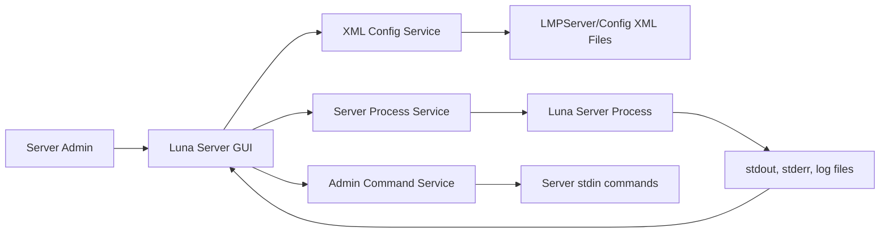

# Luna Multiplayer Server GUI Spec

## Goal

Build a Windows-first desktop executable for Luna Multiplayer server admins who do not want to manage the server through a raw command prompt or manually edit XML in Notepad.

The app should be a launcher and admin console around the existing server, not a rewrite of the server. It should manage an existing `LMPServer` folder, edit files under `LMPServer/Config`, launch the server process, pipe commands into server stdin, and display logs/status in the UI.

Relevant current paths:

- Repo: `F:/luna-multiplayer`
- Packaged server folder: `C:/Users/austi/Downloads/LunaMultiplayer-Server-win-x64-Release/LMPServer`
- Primary config folder: `C:/Users/austi/Downloads/LunaMultiplayer-Server-win-x64-Release/LMPServer/Config`
- Main server project: `F:/luna-multiplayer/Server/Server.csproj`

## Existing Server Behavior To Design Around

The server is a .NET executable project targeting `net10.0`. At runtime it loads settings from XML, starts networking/web systems, then listens for console stdin commands.

The command handler accepts:

- `/command args` as server commands.
- Plain text without `/` as chat broadcast via `say`.

Existing command registry includes:

- `ban`: ban a connected player.
- `kick`: kick a connected player.
- `say`: broadcast a message.
- `listclients`: list connected clients.
- `countclients`: count connected clients.
- `listlocks`: list current locks.
- `connectionstats`: display network traffic usage.
- `dekessler`: remove debris vessels.
- `nukeksc`: remove vessels around KSC/runway/launchpad.
- `clearvessels`: remove vessels matching filters.
- `cleancontracts`: clear finished contracts.
- `restartserver`: restart server.
- `changesettings`: write XML setting values.
- `setfunds`: set shared career funds, disabled when `PerAgencyCareer=true`.
- `setscience`: set shared science, disabled when `PerAgencyCareer=true`.
- `vessel`: vessel-related subcommands.
- `backup`: backup-related subcommands.
- `help`: list commands.

Important constraint: `changesettings` writes XML while running and logs that restart may be required. For predictable launch behavior, the GUI should edit XML before starting the server, then use stdin commands only for live admin actions.

## MVP Product Requirements

The MVP should have four major screens or tabs.

### 1. Server Folder / Setup

- Let the admin select an `LMPServer` folder.
- Validate that it contains `Config`, `Universe`, and logs folders as expected.
- Locate the actual server executable or runnable entrypoint produced by the server release/build.
- Show a clear error if the executable is missing, since the inspected downloadable folder did not show an `.exe` at its root during discovery.
- Remember recently used server folders.

### 2. Launch Settings

- Provide form controls for commonly edited XML settings.
- Save changes to XML before launching.
- Preserve XML encoding, comments where practical, and unknown elements.
- Automatically create a timestamped backup before writing config files.
- Mark settings that require restart if edited while the server is running.

Initial high-value settings to expose:

- From `GeneralSettings.xml`: `ServerName`, `Description`, `CountryCode`, `WebsiteText`, `Website`, `Password`, `AdminPassword`, `ServerMotd`, `PrintMotdInChat`, `MaxPlayers`, `MaxUsernameLength`, `AutoDekessler`, `AutoNuke`, `Cheats`, `AllowSackKerbals`, `ConsoleIdentifier`, `GameDifficulty`, `GameMode`, `ModControl`, `NumberOfAsteroids`, `NumberOfComets`, `TerrainQuality`, `SafetyBubbleDistance`, `MaxVesselParts`.
- From `ConnectionSettings.xml`: `ListenAddress`, `Port`, `HearbeatMsInterval`, `ConnectionMsTimeout`, `Upnp`, `UpnpMsTimeout`, `MaximumTransmissionUnit`, `AutoExpandMtu`.
- From `GameplaySettings.xml`: common difficulty/career options, especially `PerAgencyCareer` and `AllowEnablePerAgencyOnExistingUniverse` with strong warnings.
- From `MasterServerSettings.xml`: `RegisterWithMasterServer`, `MasterServerRegistrationMsInterval`.
- From `WebsiteSettings.xml`: `EnableWebsite`, `ListenAddress`, `Port`, `RefreshIntervalMs`.
- From `WarpSettings.xml`: `WarpMode`.
- From `LogSettings.xml`: `LogLevel`, `ExpireLogs`, `UseUtcTimeInLog`.
- From `IntervalSettings.xml`: backup intervals, archive retention, GC interval, tick/update intervals.

### 3. Server Control / Console

- Buttons: Start, Stop, Restart, Save Config, Open Config Folder, Open Logs Folder.
- Start should launch the server with working directory set to the selected `LMPServer` folder or the actual directory expected by the server binary.
- Capture stdout/stderr and show live output in a scrollable log pane.
- Provide a command input box that sends raw commands to stdin.
- Make graceful stop explicit: prefer the server's supported shutdown path. If no clean stdin command exists, use process signal/close handling and document the risk.
- Detect process state and disable invalid actions, e.g. disable Start while running.

### 4. Admin Actions

- One-click or guided actions mapped to existing commands:
  - Broadcast Message: sends `/say message` or plain message.
  - List Players: sends `/listclients`.
  - Count Players: sends `/countclients`.
  - Kick Player: sends `/kick playerName reason`.
  - Ban Player: sends `/ban playerName reason`.
  - Clean Debris: sends `/dekessler` with confirmation.
  - Nuke KSC: sends `/nukeksc` with strong confirmation.
  - List Locks: sends `/listlocks`.
  - Connection Stats: sends `/connectionstats`.
  - Backup Now: sends `/backup now` if supported by the existing backup command.
  - Restart Server: sends `/restartserver` or uses GUI-controlled restart.
- Destructive commands such as `nukeksc`, broad `clearvessels`, ban, and restart must require confirmation.
- Parameterized commands should use forms instead of making admins remember syntax.

## Suggested Architecture

Use a Windows desktop shell that can later be made cross-platform. Good options for the coding agent to choose from:

- .NET MAUI or Avalonia if staying in the .NET ecosystem and aiming for cross-platform later.
- WPF if Windows-only speed and native Windows polish matter more than future portability.
- Tauri/Electron only if the team strongly prefers web UI technologies.

Recommended internal services:

- `ServerFolderService`: validates selected server folder and discovers executable/config/log paths.
- `ConfigCatalogService`: describes known XML files, fields, types, allowed values, defaults, warnings, and restart requirements.
- `XmlConfigService`: loads, validates, edits, backs up, and saves XML without deleting unknown fields.
- `ServerProcessService`: starts/stops/restarts process, pipes stdin, captures stdout/stderr, tracks state.
- `AdminCommandService`: maps button/form actions to existing stdin commands.
- `LogTailService`: reads latest `logs/lmpserver_*.log` and optionally merges with process output.
- `ProfileService`: saves named server profiles/presets outside the LMP folder.

## Validation And Safety Rules

The GUI should validate before saving:

- Required strings and max lengths from XML comments where known, e.g. server name max 30, description max 200, password/admin password max 30.
- Numeric ranges where comments define them, e.g. RGB 0-255, MTU 1-8192, master registration minimum 5000ms.
- Enum values such as `GameDifficulty`, `GameMode`, `TerrainQuality`, `WarpMode`, and `LogLevel`.
- Port values and port conflicts where possible.
- `HearbeatMsInterval` must be lower than `ConnectionMsTimeout`.
- `PerAgencyCareer=true` should show warnings: choose before universe population; do not casually change mid-save.
- `AllowEnablePerAgencyOnExistingUniverse=true` should require an advanced warning/confirmation.
- `setfunds` and `setscience` buttons should be hidden or disabled when `PerAgencyCareer=true`.

Every config save should:

- Backup changed files first.
- Show a diff-style preview or summary before applying, at least for advanced settings.
- Avoid modifying universe files unless the admin explicitly enters an advanced maintenance workflow.

## MVP Non-Goals

Do not include these in version 1 unless easy after MVP is complete:

- Full mod-control editor for huge `LMPModControl.xml` part lists.
- Full vessel browser/editor.
- Universe save migration tools.
- Remote web admin or multi-user admin auth.
- Automatic router/firewall setup beyond showing UPnP and port status.
- Rewriting server command handling.

## Future Roadmap

After MVP:

- Player table with live player list parsed from server state/log output or website JSON endpoint.
- Ban list editor for `LMPPlayerBans.txt`.
- Whitelist/group/permissions editor if supported by existing server files.
- Profile presets such as Public Career, Private Friends, Testing/Debug, Sandbox Dogfight.
- Scheduler for restarts, backups, `/dekessler`, and `/nukeksc`.
- Health dashboard: uptime, port, NAT/UPnP result, player count, log level, backup age.
- Config import/export as shareable JSON presets.
- Built-in update checker for server builds.
- Cross-platform packaging after Windows MVP stabilizes.

## Acceptance Criteria

The coding agent is done with MVP when:

- A Windows admin can select an `LMPServer` folder and see whether it is valid.
- The GUI can read and edit core XML settings without opening Notepad.
- Saving settings creates backups and preserves unrecognized XML fields.
- The GUI can start the Luna server and show live output/logs.
- The GUI can send at least these commands through buttons/forms: say, listclients, countclients, kick, ban, dekessler, nukeksc, restartserver.
- Destructive commands require confirmation.
- Running/stopped UI state is accurate.
- Errors such as missing executable, invalid XML, invalid port, or failed launch are shown clearly to the admin.

## Implementation Tasks For Coding Agent

1. Confirm where the packaged server executable or run entrypoint is produced and how releases should be bundled.
2. Create a typed catalog for XML settings, including file name, element name, data type, validation, help text, and restart requirement.
3. Implement process start/stop/restart with stdin command piping and live output capture.
4. Implement setup, launch settings, console/logs, and admin actions screens.
5. Test XML backup/preservation, validation failures, process lifecycle, and command formatting for destructive/admin actions.
